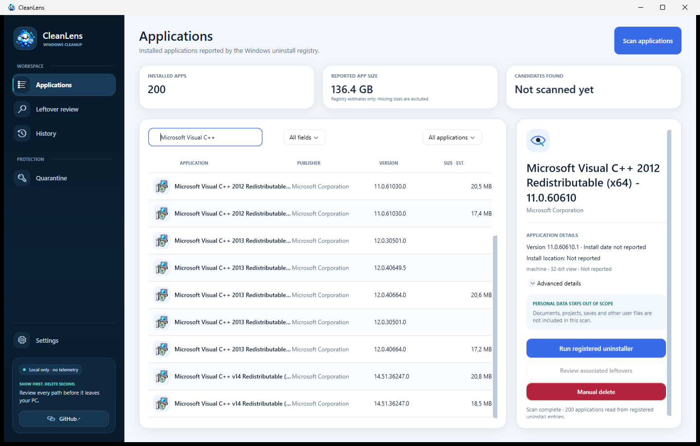

  

<h1 align="center">CleanLens</h1>

  <strong>Remove the app. See what it leaves behind.</strong> 
  A local-first Windows uninstaller that puts every cleanup decision in your hands.

  <a href="https://loxyyit.github.io/CleanLens/">Project website</a> ·
  <a href="https://github.com/LoxyyIT/CleanLens">Source repository</a> ·
  <a href="CONTRIBUTING.md">Contributing</a> ·
  <a href="SECURITY.md">Security</a>

  
  
  
  
  
  

  

<em>Real Windows capture. Inventory and app details vary by PC.</em>

## Why CleanLens

An application's official uninstaller can leave settings, caches and other application data behind. CleanLens aims to make that cleanup understandable: see the path, see why it matched, and choose whether to move it.

The project is in early development. The current source is a deliberately narrow Windows prototype; it is not yet the complete uninstaller described in the long-term roadmap.

## Features

- **Installed app inventory:** reads uninstall entries from HKLM and HKCU in both 32-bit and 64-bit Registry views. App icons come from Windows, with a monogram fallback when an icon is unavailable.
- **Search and filters:** search all fields or narrow by app name, publisher, version or install path. Filter by uninstaller availability, publisher information and reported size.
- **Reviewed uninstall:** inspect the registered uninstall command before CleanLens asks Windows to launch it. The command comes from local Registry metadata and remains under the app's own uninstall logic.
- **Leftover review:** after the uninstall completes and a fresh inventory confirms the app is no longer registered, scan exact product folders and publisher/product pairs in the current user's AppData and shared ProgramData. Each result includes its full path, reason, size estimate and confidence; nothing is selected automatically.
- **Manual delete scan:** separately review registered install and Windows Installer locations, Program Files and Program Files (x86), app-data folders in accessible Windows profiles, Steam app-ID paths and exact-name matches in supported personal libraries.
- **Quarantine or permanent deletion:** from the manual path list, move selected files and folders into local quarantine for later restore, or permanently delete them after a separate confirmation. If Windows denies a move, CleanLens asks you to restart it as administrator; it does not elevate itself.
- **Local records and settings:** browse operation history and quarantined items, restore items when their original paths are available, and keep the selected interface language and safety acknowledgement locally.

## Safety boundaries

The standard leftover scan checks exact product-named folders in the current user's AppData and shared ProgramData only after an uninstall is confirmed. Manual delete checks the additional locations listed above, including Program Files x64/x86, app data from accessible user profiles and selected personal libraries. It uses exact folder-name or publisher/product matches; a matching name is not proof that a path belongs to the app. Every result starts unchecked. Moving to quarantine is reversible when the original path is free; permanent deletion has a separate confirmation and may remove program or personal files.

CleanLens does not scan the whole disk, inspect file contents, or cover every Windows app type and every leftover location. MSIX inventory, services, scheduled tasks and startup entries are not part of the current cleanup scan. Junctions and symbolic links are refused by cleanup guards, but path checks cannot eliminate every race with other software.

Standard cleanup moves a selected application-data folder to quarantine. Manual deletion is a distinct, irreversible operation. Both actions revalidate selected paths and refuse paths outside supported roots and folders containing reparse points. This reduces risk but cannot eliminate races caused by other software changing filesystem state concurrently. A quarantine move is not a guarantee that an application can be fully restored.

**Warning:** inappropriate use or a wrong path can damage Windows, break applications or permanently remove personal files. Review the full path list and proceed only when you accept responsibility for the selected items.

An uninstall command comes from the Windows Registry and is untrusted input. CleanLens displays it before launching it. The command is executed by Windows as registered; inspect the executable and arguments and cancel if they are unexpected. The application's own uninstaller controls its removal behavior.

CleanLens starts only an existing, fully qualified executable path, apart from MSI commands which are resolved to Windows' system msiexec.exe. It refuses quiet-only uninstall entries. Authenticode signer verification of third-party uninstallers is not implemented.

## Interface

The WPF application and static website support English, Italian, Spanish and French. The desktop language choice is saved locally. Overview has been consolidated into the Applications page. Appearance themes and accessibility validation are still planned.

## Download

The first self-contained Windows x64 build is available from [GitHub Releases](https://github.com/LoxyyIT/CleanLens/releases/latest). Download the portable ZIP, extract it and run `CleanLens.exe`. The build is unsigned and does not include an installer or updater; Windows SmartScreen may show a warning.

## Build

Requirements: Windows, .NET 10 SDK and a network connection for the first NuGet restore.

    dotnet restore CleanLens.sln
    dotnet build CleanLens.sln -c Release
    dotnet test CleanLens.sln -c Release

Create a self-contained Windows x64 publish directory:

    dotnet publish src/CleanLens.App/CleanLens.App.csproj -c Release -r win-x64 --self-contained true -o artifacts/CleanLens-win-x64

The publish directory includes the .NET runtime and is suitable for packaging as a portable ZIP. The current public build is unsigned; a signed installer and updater are not provided.

## Architecture

| Project | Responsibility |
| --- | --- |
| CleanLens.App | WPF desktop interface and local dependency setup |
| CleanLens.Core | Application and candidate models, confidence and path policy |
| CleanLens.Windows | Registry inventory, registered uninstaller launch, limited folder scan and quarantine |
| CleanLens.Data | Local SQLite history and quarantine metadata |
| tests/CleanLens.Core.Tests | Safety, parser and sandboxed quarantine tests |
| docs/ | Static GitHub Pages website |

## Roadmap

See ROADMAP.md for planned work and current boundaries. MSIX/AppX inventory, services, scheduled tasks, startup components, file signatures, real measured disk usage, install monitoring, complete desktop localization, light/dark/system themes and broader validation are not implemented.

## Privacy

The desktop application has no telemetry, analytics, account or cloud component. Inventory scans and cleanup happen locally. History and quarantine records are stored below %LOCALAPPDATA%\CleanLens.

## Contributing

Read CONTRIBUTING.md and SECURITY.md before proposing changes to path handling or cleanup behavior. Destructive tests must use temporary fixtures only.

## License

CleanLens is licensed under the MIT License. See LICENSE.
